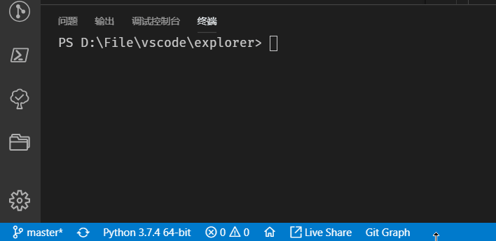

## explorer
> A simple python cli file browser



## usage

### clone source code to your computer
```
git clone https://github.com/WangTingZheng/explorer.git
cd explorer
pip3 install -r  requirements.txt
```
### edit suffix list in `run.py`
```python
from explorer.menu import *
lists=[".py"]
menu("./",lists)
```
`lists` is a setting list to let cli display the file you want. `lists=['.py']` means only display python file and folder that have python file, `[]` means display all

### run

``
python run.py
``
- Press `j` to move up
- Press `k` to move down
- Press `space` to select and deselect
- Press `enter` to confirm
## To-Do
- deal function design for different file
- package to pypi.ory
- ignore list


